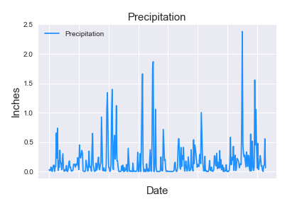

# Surfs_up_Mr.Data

So I've never been to Hawaii before and I am as excited to go as I am worried about the weather. San Diego, where I'm from, doasn't get a lot of rain, and when we do it washes away everyones ability to drive. You would think the roads were covered in ice and everyones tires were as bald as Sir Patrick Stewart.  Well I watched a lot, and I mean A LOT, of Star Trek:TNG, and some of that shows' science wore off on me. Now I can't just say "Computer" (sounds like "Com-pew-ta") and have the ship tell me the answer to whatever I ask (AI goals for Hey Alexa) like they do on the Enterprise... 

...But I can use my analytics skills and get some data for my upcoming trip. With the magic of SQLAlchemy I can turn a few keystrokes into the information I need. By pulling the data from 9 of the most active weather collecting stations on Hawaii I was able to graph the precipitation levels for the entire year preceding the day of my trip. 

 

And the fun doasn't end there. I also created an image to help me see the temperatures captured by the most active of those stations. 

Finally I wanted to see what the average temperature would be for my trip, including highs and lows. All that rain combined with high temps reaching into 90's means hot and humid.  And I know excactly what to do in that type of weather: stay in my hotel room, call up some room service, and hang out with my fav character __Data__. At least I wont be the palest guy on the island! __Mahalo!!!__  
